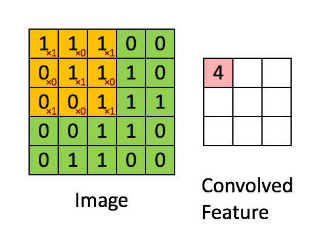
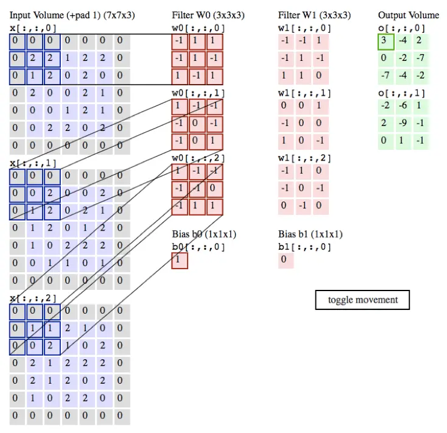

# 第2章 深度学习基础

1. 介绍CNN的原理。讲解Kernel、Filter、Channel、Layer的联系与区别。
2. 结合pytorch实践将第一部分的原理与实际结合。
3. 介绍模型压缩的评估指标。

>有一些基础的同学应该都了解过CNN，那么能分清层（layers）、通道（channels）、特征图（feature maps）、滤波器（filters）、卷积核（kernels）等这些术语的区别吗？如果分不清，请带着疑问阅读本教程。

## CNN介绍

## CNN架构

## 相关术语解读

- 层（layers）：
- 通道（channels）：
- 特征图（feature maps）：
- 滤波器（filters）：
- 卷积核（kernels）

### 层与通道

### 滤波器、卷积核与特征图

卷积核是一个2维矩阵，长 × 宽；通常用2D于卷积运算。下图是对一个单通道的图片做卷积操作：

其中，黄色矩阵为卷积核，其大小是`3 × 3`，卷积核的数目为`1`，最终得到`1`个特征图，即红色矩阵。

在单通道情况下，过滤器和卷积核表示一个东西，即过滤器=卷积核。

下图是对一个3通道的图片做卷积操作：

其中，有三个卷积核（Kernel Channel），卷积核的大小为`3 × 3`，卷积核的数目为`3`，过滤器指的就是这三个卷积核的集合，维度是 `3 × 3 × 3`，分别代表卷积核的高度、宽度及深度（卷积核的数目）。该卷积操作首先对三个通道分别做卷积操作，然后将卷积的结果相加，最后输出一个特征图。

如果想要设计一个网络，那么怎么确定滤波器数量呢？怎么确定一个滤波器中卷积核的数量呢？下面来看一个例子，因为3D数据难以可视化，所以所有的数据（输入数据体是蓝色，权重数据体是红色，输出数据体是绿色）都采取将深度切片按照列的方式排列展现。

卷积运算本质上就是在滤波器和输入数据的局部区域间做点积。卷积层的常用实现方式就是利用这一点，将卷积层的前向传播变成一个巨大的矩阵乘法。第二列中的这三个`3x3`内核形成了一个滤波器。正如第三列所示。滤波器的数量始终等于下一层中特征图的数量。而每个过滤器中的卷积核数量将始终等于该层中的特征图数量。

一个滤波器负责提取一种特征，所以想要提取`N`个特征，输出`N`个特征图，那么就需要设置`N`个滤波器，即滤波器数量等于特征图数量。

假设已经确定了滤波器，卷积核的数量由输入数据的通道数量所确定，当输入数据是3个通道时，则后续的每一个滤波器中包含3个卷积核。

### 总结

- 卷积核是滤波器的基本元素， 多个卷积核组成一个滤波器，当输入为2维时，两者相等;
- 提取`N`个特征就要设置`N`个滤波器，滤波器数量等于特征图数量；
- 卷积核数量等于输入数据通道的数量；

## 模型压缩常见评估指标

## 参考链接

- <https://blog.csdn.net/weixin_38481963/article/details/109906338>
- <https://cs231n.github.io/convolutional-networks/>