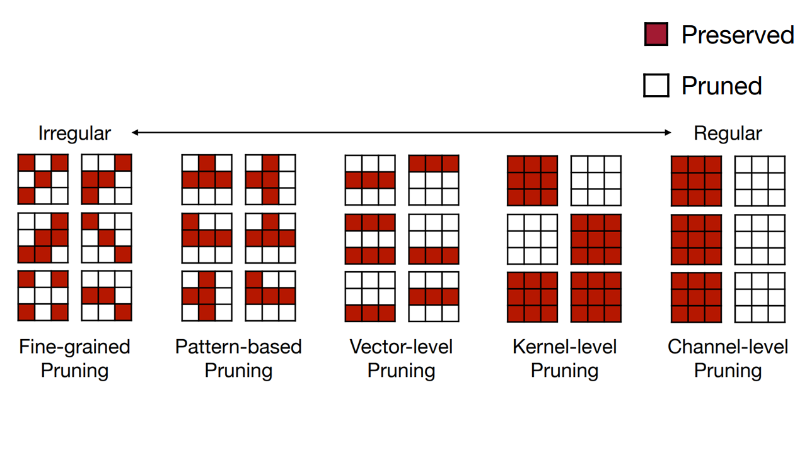

# 第3章 模型剪枝

## 介绍

剪枝是模型压缩中一种重要的技术，其基本思想是将模型中不重要的权重和分支裁剪掉，将网络结构稀疏化，进而得到参数量更小的模型，降低内存开销，使得推理速度更快。

## 为何剪枝（Why Pruning?）

彩票假设(lottery ticket hypothesis)：在随机初始化的密集神经网络中，存在一些子网络（称为“中奖票”），这些子网络在单独训练时可以达到与原始网络相似的测试精度，且所需的迭代次数相同。

## 何为剪枝（What is Pruning?）

按照剪枝粒度进行划分，剪枝分为非结构化剪枝和结构化剪枝。
- 非结构化剪枝：修剪参数的单个元素。
- 结构化剪枝：有选择性地移除网络的较大部分，比如一层或一个通道。

### 非结构化剪枝

### 结构化剪枝

按照剪枝范围进行划分，剪枝分为局部剪枝和全局剪枝。
- 局部剪枝：
- 全局剪枝：

### 局部剪枝

### 全局剪枝

## 怎么剪枝（How to prune?）

### 基于权重(weight)

### 基于神经元(neuron)

## 剪枝时机（When to prune?）

### 训练后剪枝

### 训练时剪枝

## 剪枝频率（How often?）

### 迭代（Iterative）

### One-Shot

